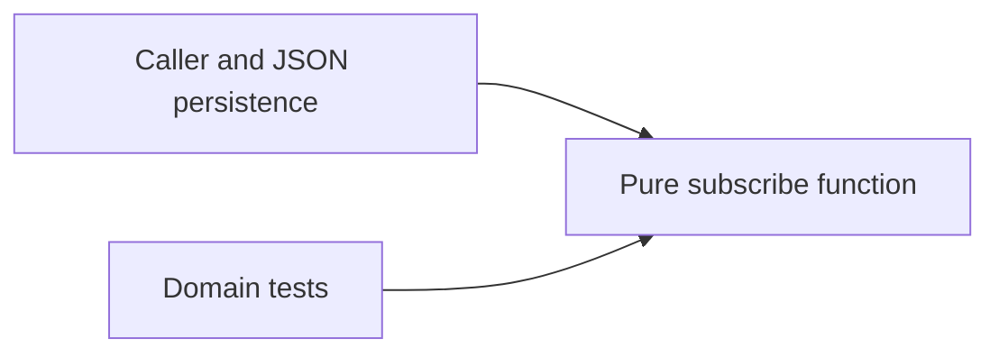

# Architecture Spine — subscriptions

## Design Paradigm
Functional core: the caller passes all state to `src/subscriptions.mjs` and owns any persistence.

## Invariants & Rules
### AD-1 — Caller-owned immutable state [ADOPTED]
- **Binds:** CAP-1, CAP-2, CAP-3, CAP-4.
- **Prevents:** a hidden store diverging from the caller's restored data.
- **Rule:** never mutate input arrays or records; compute results only from the supplied state and email.

### AD-2 — One normalization boundary [ADOPTED]
- **Binds:** CAP-1, CAP-2, CAP-3.
- **Prevents:** validation and lookup disagreeing about the same email.
- **Rule:** validate type, trim and lowercase once, enforce the shared regex and 254-character ceiling, then compare normalized input with existing email values.

### AD-3 — Stable sequential identity [ADOPTED]
- **Binds:** CAP-2, CAP-3, CAP-4.
- **Prevents:** retries and restart creating additional identities.
- **Rule:** preserve the existing duplicate record; new ID is `sub-` plus input array length plus one. No clock, randomness, I/O, or module state.

## Consistency Conventions
| Concern | Convention |
| --- | --- |
| Public interface | `subscribe(state, email)` returns `{state, subscription, created}` |
| Validation failure | Throw TypeError before any state change |
| Runtime envelope | Local ECMAScript module; no deployment or external infrastructure |

## Deferred
Malformed existing records and concurrent distributed writes are outside the supplied contract. Revisit only if the caller's state contract or local-only scope changes.
